# Kozmik Lahmacun

[](#project-status)
[](LICENSE)
[](backend/pom.xml)
[](executor/pyproject.toml)
[](frontend/package.json)

Kozmik Lahmacun is a single-tenant, governed analytics platform for people who
need business answers without writing SQL, Spark code, or machine-learning
pipelines. Reporters request controlled reports in natural language.
Scientists and Administrators can additionally request predictive analysis,
automatic model comparison, and bounded what-if evaluation.

The platform enforces the following privacy invariant:

> Your underlying corporate datasets are never sent to or processed by the
> LLM. They remain inside the controlled execution environment.

The LLM interprets a request using authorized entity and column metadata and
proposes a versioned JSON execution order. Python validates that order against
explicit operation, algorithm, parameter, schema, and role registries. Only
then does trusted Spark code process data inside the controlled environment.
Arbitrary SQL, generated Python, generated shell commands, and arbitrary
executable code are not accepted.

After Spark finishes, the LLM receives a separate bounded facts object—not the
underlying dataset—to produce a plain-language management summary. This
applies to both reports and ML results. A non-technical manager can therefore
ask for a grouped sales comparison, a prediction, or a controlled scenario
analysis and receive the calculation, visualizations, relevant limitations,
and a concise business explanation in the same interface.

## Project status

Kozmik Lahmacun is under active development. The repository contains an
integrated control plane, execution plane, web product, identity system,
secret store, event backbone, governed object storage, ingestion paths,
reporting engine, ML engine, and acceptance suite. Execution coverage,
operational hardening, and product behavior continue to evolve.

The product interface currently supports **English and Turkish only**.
Prompts in English receive English responses; prompts in Turkish receive
Turkish responses. Other prompt languages fall back to English. Persisted
results retain the language selected when their execution was planned.

## What the platform enables

For a non-technical user, the primary workflow is conversational:

1. Select or refer to an available data entity in chat.
2. Describe a report, prediction, or controlled what-if question.
3. Continue working while the request is planned and executed asynchronously.
4. Follow durable execution progress from the UI.
5. Open the completed result with management summary, KPIs, metrics, charts,
   warnings, and a bounded preview.

The platform handles the technical translation:

```text
Natural-language request
  -> intent classification
  -> governed JSON order proposal
  -> deterministic validation
  -> trusted Spark operations
  -> governed result and artifacts
  -> privacy-safe management explanation
```

Users do not need to select an estimator, construct filters or aggregations,
build a Spark pipeline, interpret tuning trials, or translate technical
metrics into management language. Authorized users retain access to technical
execution details for traceability.

## Architecture

### System context

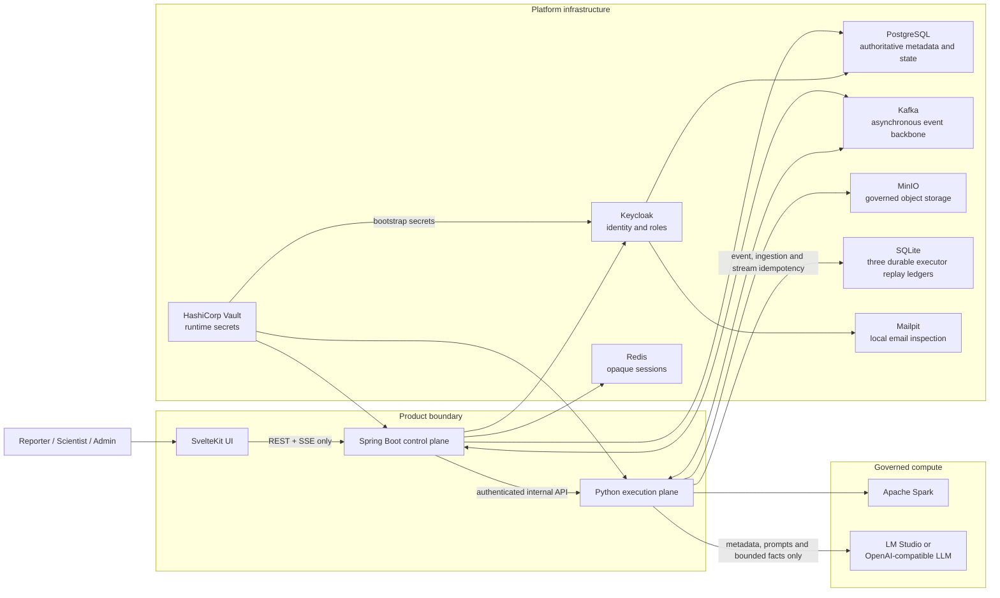

The browser communicates only with Java. It never directly accesses Python,
Kafka, PostgreSQL, Redis, SQLite, MinIO, Vault, the Keycloak Admin API, Spark,
or an LLM provider.

### Governed report and ML execution

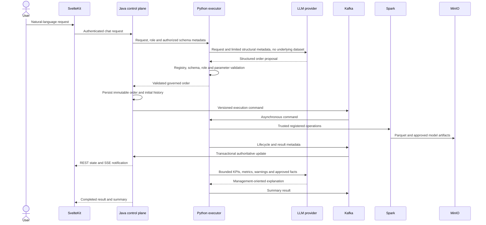

Interactive chat streaming uses Java-to-Python HTTP streaming rather than
Kafka. Execution, result, cancellation, and ingestion lifecycles use Kafka.
The UI uses separate SSE channels for chat and execution events and reloads
authoritative REST state after reconnect.

### Governed ingestion

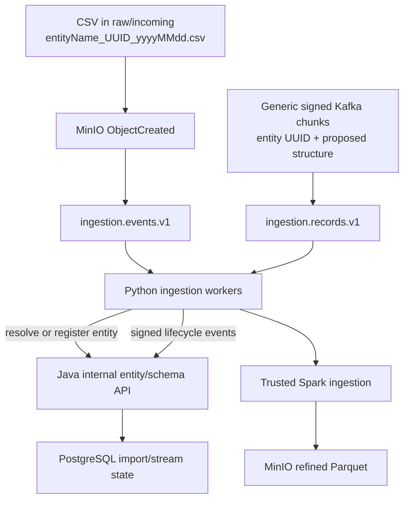

File ingestion is event-driven from MinIO; Python does not poll buckets.
Continuous ingestion accepts bounded generic Kafka chunks for CDR, XDR, HR,
IoT, or other entity types. Existing entity UUIDs reuse normalized metadata.
An unknown UUID can be registered transactionally through Java using the
proposed structure. Structural drift for an existing UUID is rejected.

Each execution is bound to an immutable governed artifact or committed stream
checkpoint so later ingestion cannot change the data observed by an already
started execution.

### Continuous Kafka ingestion contract

Continuous Kafka ingestion uses the generic `ingestion.records.v1` topic.
Telecom CDR is the included demonstration dataset; the same versioned contract
supports XDR, HR, IoT, financial, and other record-oriented sources.

Entity onboarding is contract-driven and does not require application code
changes or database migrations. A producer supplies a new entity UUID, its
ordered column structure, and signed record chunks. Java transactionally
registers an unknown entity and its normalized columns; subsequent chunks with
the same UUID reuse that metadata. A materially different structure requires a
new entity UUID.

For example, a 500,000-record Customer stream can be published as 100 chunks
of 5,000 records. All chunks use the same entity UUID and `streamId`, a unique
`chunkId`, and monotonically increasing `sequence` values. The topic remains
open for later Customer chunks and for unrelated entities identified by their
own UUIDs.

After signature verification and envelope decoding, the logical payload has
the following structure:

```json
{
  "schemaVersion": "1.0",
  "chunkId": "e370bf69-f82d-5ca4-8408-56bf81b23920",
  "streamId": "cb250d82-d36a-42b1-b3af-8c584bfacbed",
  "entity": {
    "id": "22222222-2222-4222-8222-222222222222",
    "name": "telecom_cdr",
    "description": "Telecom call-detail events",
    "nameTr": "Telekom çağrı kayıtları",
    "descriptionTr": "Telekom çağrı detay olayları",
    "columns": [
      {
        "columnName": "cdr_id",
        "businessName": "CDR ID",
        "businessNameTr": "CDR ID",
        "dataType": "STRING",
        "ordinalPosition": 1
      },
      {
        "columnName": "event_time",
        "businessName": "Event time",
        "businessNameTr": "Olay zamanı",
        "dataType": "TIMESTAMP",
        "ordinalPosition": 2
      },
      {
        "columnName": "duration_seconds",
        "businessName": "Duration seconds",
        "businessNameTr": "Süre (saniye)",
        "dataType": "INTEGER",
        "ordinalPosition": 3
      },
      {
        "columnName": "call_type",
        "businessName": "Call type",
        "businessNameTr": "Arama türü",
        "dataType": "STRING",
        "ordinalPosition": 4,
        "categoricalValues": ["INCOMING", "OUTGOING", "INTERNATIONAL"]
      },
      {
        "columnName": "charge_amount",
        "businessName": "Charge amount",
        "businessNameTr": "Ücret tutarı",
        "dataType": "DECIMAL",
        "ordinalPosition": 5
      }
    ]
  },
  "sourceId": "gsm-tower-cluster-34",
  "producedAt": "2026-07-30T10:15:30Z",
  "sequence": 42,
  "records": [
    {
      "cdr_id": "CDR-000021001",
      "event_time": "2026-07-30T10:15:27Z",
      "duration_seconds": 184,
      "charge_amount": 12.45
    },
    {
      "cdr_id": "CDR-000021002",
      "event_time": "2026-07-30T10:15:29Z",
      "duration_seconds": 61,
      "charge_amount": 4.1
    }
  ]
}
```

Important contract rules:

- `chunkId` identifies an idempotent finite batch.
- `streamId` identifies the continuing logical stream or dataset.
- `entity.id` is the durable entity UUID used for metadata and governed
  artifact resolution.
- `sourceId` identifies the upstream producer.
- `sequence` is monotonic within a stream and becomes part of the execution
  checkpoint.
- `records` contains between 1 and 5,000 objects. Record keys must match the
  declared columns; Spark interprets them using the registered ordinal
  positions and types.
- Supported declared types are `STRING`, `INTEGER`, `LONG`, `DECIMAL`,
  `BOOLEAN`, `DATE`, and `TIMESTAMP`.
- Column names use a restricted identifier format; descriptions and Turkish
  display metadata are optional.
- A string column may declare up to 32 exact `categoricalValues`. Direct CSV
  ingestion discovers a vocabulary only when the complete column has at most
  32 distinct values; identifier columns are excluded. These normalized values
  let planning translate business wording to stored categories without sending
  source records to the language model. Values outside a registered vocabulary
  are rejected before Spark execution.
- When the entity UUID already exists, its normalized stored structure is
  reused and structural drift is rejected. When it does not exist, Java
  transactionally registers the entity and its columns before processing.

Kafka records use a signed envelope rather than unsigned JSON. The logical
payload is UTF-8 JSON, Base64URL-encoded, and protected by an HMAC-SHA-256
signature:

```json
{
  "schemaVersion": "1.0",
  "payload": "<base64url encoded logical message>",
  "signature": "<base64url HMAC-SHA256 signature>"
}
```

The Kafka record key is the entity UUID. Python verifies the envelope before
parsing the payload, validates the chunk contract, resolves the entity through
Java, applies the registered Spark types, and writes an immutable Parquet part
under:

```text
refined/entities/{entityId}/streams/{streamId}/dataset/part-{sequence}-{chunkId}.parquet
```

Offsets are committed only after processing. Duplicate chunks do not rewrite
data. Signed lifecycle updates on `ingestion.stream.status.v1` advance Java's
authoritative cumulative row count and committed Kafka checkpoint.

### MinIO object layout

MinIO uses S3-compatible object keys. The paths below are directory-like
prefixes rather than operating-system directories:

| Bucket | Object-key structure | Purpose |
|---|---|---|
| `raw` | `incoming/{entityName}_{entityId}_{yyyyMMdd}.csv` | Direct CSV arrival area. A matching `ObjectCreated` event starts file ingestion. |
| `refined` | `entities/{entityId}/imports/{importId}/data.parquet` | Governed Parquet produced from one direct CSV import. |
| `refined` | `entities/{entityId}/streams/{streamId}/dataset/part-{sequence}-{chunkId}.parquet` | Immutable Parquet parts appended from bounded Kafka stream chunks. The sequence is zero-padded to 12 digits. |
| `results` | `executions/{executionId}/{artifactId}.parquet` | Full report output or bounded ML-prediction artifact. |
| `models` | `executions/{executionId}/{modelArtifactId}.zip` | Serialized Spark ML model artifact. |

The entity UUID is therefore present in every governed dataset prefix, while
execution outputs are isolated by execution UUID. Java persists the matching
bucket, object key, size, entity, ingestion checkpoint, and ownership metadata
in PostgreSQL; it does not read or write these analytical objects. Only the
Python execution plane uses scoped MinIO credentials. The browser receives
authorized previews and metadata through Java and has no direct MinIO access or
Parquet/model download endpoint.

For file ingestion, the source CSV remains under `raw/incoming` and the
validated representation is written under `refined`. For Kafka ingestion,
records go directly from a verified Kafka chunk to an immutable `refined`
Parquet part; they are not copied into the `raw` bucket first. Replayed
object-created events and duplicate stream chunks are handled idempotently.

## Architectural responsibilities

| Component | Primary responsibility | State ownership | Interfaces |
|---|---|---|---|
| SvelteKit frontend | Authenticated product shell, chat, execution/result views, charts, localization and admin UX | Browser presentation state only | Java REST and SSE |
| Java control plane | Users, authorization, chat history, entity metadata, execution orchestration, durable lifecycle, audit and retention | PostgreSQL and Redis | Browser, Keycloak, Kafka and authenticated Python APIs |
| Python executor | LLM interaction, classification, governed planning, Spark reports, Spark ML, ingestion and MinIO artifact operations | MinIO artifacts and executor-local SQLite replay ledgers | Java, Kafka, Spark, MinIO and LLM |
| PostgreSQL | Authoritative application metadata, execution/import history, audit state and Keycloak identity database | Durable relational state | Java and Keycloak |
| Redis | Opaque server-side HTTP session and OIDC token storage | Session state | Java only |
| Kafka | Versioned execution, result, control and ingestion event backbone | Durable topics | Java and Python |
| MinIO | Raw arrivals, refined datasets, report results and model artifacts | Durable objects | Python and initialization jobs |
| SQLite replay ledgers | Executor-local processed-event IDs, retry counters, completed ingestion IDs and streaming chunk checkpoints | Durable operational state in the executor volume | Python only |
| Keycloak | OIDC identity, login, password workflows and platform roles | Identity state | Browser redirect and Java |
| Vault | Scoped runtime secret delivery | Secrets | Bootstrap, Java, Python and Keycloak bootstrap |
| Mailpit | Local SMTP capture and password/invitation email inspection | Disposable local messages | Keycloak |

### Control plane and execution plane

- Java owns users, roles, authorization, metadata, chat history, execution
  history, audit records, idempotency state, retention, and authoritative API
  responses.
- Python owns LLM calls, structured planning validation, Spark operations,
  model training, result production, and all MinIO reads and writes.
- Python does not access PostgreSQL or Keycloak directly.
- Java does not read or write analytical MinIO artifacts.
- Kafka is not used for browser communication or interactive chat.
- Contract `schemaVersion` fields version API and Kafka message formats. Entity
  schemas are not versioned: a materially different data structure represents
  a different entity UUID.

### Executor replay ledgers

The Python executor maintains three small SQLite ledgers. They are runtime
components, not test fixtures:

```text
/var/lib/kozmik/execution-events.sqlite3
/var/lib/kozmik/ingestion-events.sqlite3
/var/lib/kozmik/stream-ingestion.sqlite3
```

The files persist in the private `executor-state` Docker named volume. Local
non-container execution places their equivalents under `executor/.runtime/`.
They contain operational identifiers and counters only: processed Kafka event
UUIDs, ingestion event and chunk UUIDs, retry counts, stream UUIDs, row counts,
MinIO object keys and completion timestamps. They do not contain source
datasets, result rows, prompts, credentials, provider tokens, user profiles or
chat content.

This operational state is security-relevant despite containing no corporate
dataset:
tampering could weaken duplicate-event and replay protection. SQLite access
uses parameter binding, the files are not exposed by an HTTP API, and the
executor is their sole application owner. The current topology therefore
protects them through container isolation and the executor-owned persistent
volume. SQLite is intentionally local to the documented single-executor
topology; it is not a shared coordination mechanism for horizontally scaled
executor replicas.

SQLite is used here deliberately because the ledger workload is small,
write-light and local to one executor process. It provides atomic commits,
primary-key uniqueness and restart persistence through Python's standard
library without giving Python access to Java-owned PostgreSQL or overloading
Redis, whose platform responsibility is server-side browser sessions and OIDC
tokens. Kafka offsets alone are insufficient: an event can produce Spark or
MinIO side effects before an offset is committed, so a redelivery still needs
a durable event/chunk identifier check. An in-memory set would lose that
protection on restart, while an additional network database would add an
operational dependency without improving the current single-executor
topology. Horizontal executor replication requires a shared transactional
idempotency and checkpoint store.

### Durability and consistency model

The platform does not treat Kafka publication and database mutation as one
distributed transaction:

- Java writes a validated execution request, initial status and command-outbox
  row in one PostgreSQL transaction. A scheduled publisher sends unpublished
  outbox records to Kafka and records publication attempts.
- Java Kafka consumers update authoritative execution/import history and
  processed-event identifiers transactionally. Replayed events therefore do
  not duplicate lifecycle rows or result metadata.
- Python commits Kafka offsets only after governed processing and uses its
  durable SQLite ledgers to prevent repeated Spark/MinIO side effects after
  redelivery or restart.
- Cross-store deletion is a durable retryable workflow: Python removes MinIO
  artifacts before Java finalizes relational deletion. A partial failure
  remains recoverable rather than being reported as a completed delete.
- Keycloak user-management changes use durable operation records and retry
  reconciliation so identity state and Java-owned user references do not
  silently diverge after a remote failure.
- SSE is a notification channel, not the source of truth. After reconnect, the
  browser reloads authoritative state from Java REST APIs.

This is an at-least-once event architecture with idempotent consumers and
durable reconciliation, not an exactly-once claim across PostgreSQL, Kafka,
Spark, MinIO and Keycloak.

## Reporting model

The reporting path accepts versioned Pydantic orders and rejects SQL text. The
approved registries cover projections, aggregations, grouping, temporal
grouping, nested `AND`/`OR` filters, `HAVING`, ordering, bounded limits, KPIs,
and chart hints. Python maps a validated order to explicit Spark DataFrame
operations.

The following abbreviated order illustrates the report contract:

```json
{
  "schemaVersion": "1.0",
  "executionType": "REPORT",
  "entityId": "11111111-1111-4111-8111-111111111111",
  "payload": {
    "select": [{"column": "region", "alias": "region"}],
    "aggregations": [
      {"function": "SUM", "column": "net_amount", "alias": "total_sales"}
    ],
    "groupBy": ["region"],
    "filters": [],
    "orderBy": [{"column": "total_sales", "direction": "DESC"}],
    "limit": 100
  }
}
```

Full report results are stored as governed Parquet. The browser receives at
most 20 preview rows, scalar indicators, charts, warnings, row counts, and
result metadata. Direct Parquet download is not exposed.

## Machine learning

ML access is restricted to `SCIENTIST` and `ADMIN`. The explicit algorithm
registry currently supports:

| Problem type | Supported algorithms |
|---|---|
| Regression | Linear regression, decision-tree regression, random-forest regression, gradient-boosted trees and XGBoost |
| Binary classification | Logistic regression, decision-tree classification, random-forest classification, gradient-boosted trees and XGBoost |

Orders define governed target/features, filters, deterministic splits,
metrics, bounded parameters, and optional controlled what-if scenarios.
Automatic selection is deliberately bounded to five candidate algorithms and
fifty tuning trials. The best candidate is selected from validation metrics and
then evaluated against an untouched test set.

Regression results can include RMSE, MAE and R². Classification results can
include accuracy, F1, precision, recall, AUC and approved probability facts.
Feature importance is exposed where the selected model supports it. The result
also contains a bounded predictions preview and model-selection facts.

What-if analysis changes only the explicitly requested inputs within approved
ranges and compares predicted outcomes with an unchanged baseline. It does not
establish causality or automatically account for demand, cost, profit,
retention, competitor response, or other unmeasured effects.

## Management summaries and privacy

Management explanation is a separate, non-critical stage after trusted
execution:

1. Spark finishes and durable artifacts are written.
2. Python constructs a bounded allowlisted facts object.
3. Direct identifiers, source datasets, record-level contents, prediction
   previews and object paths are excluded.
4. Approved report breakdowns, scalar KPIs, metrics, warnings, strongest
   drivers and controlled scenario facts may be included.
5. The configured LLM writes a short Turkish or English management summary.
6. Java persists the summary status and text with the result.

Report summaries describe approved comparisons, rankings, ranges, or time
patterns. ML summaries describe reliability and important drivers without
pretending technical metrics are probabilities. A directional management
recommendation is permitted only when calculated scenario evidence supports
it, and it remains explicitly conditional.

If the provider is unavailable or returns an invalid explanation, the Spark
result remains completed and usable. Summary failure does not invalidate
metrics, charts, preview data, or persisted artifacts.

## Roles and product capabilities

| Capability | Reporter | Scientist | Admin |
|---|:---:|:---:|:---:|
| View registered data entities | ✓ | ✓ | ✓ |
| Conversational chat | ✓ | ✓ | ✓ |
| Create governed reports | ✓ | ✓ | ✓ |
| Request ML execution |  | ✓ | ✓ |
| View/delete own executions and results | ✓ | ✓ | ✓ |
| Manage users |  |  | ✓ |
| View/delete all users' executions |  |  | ✓ |
| Export completed execution/result views to PDF |  |  | ✓ |

The UI uses one effective platform role per managed user. Authorization is
enforced in Java and independently validated by Python for execution orders;
navigation visibility is not treated as the security boundary.

## Example prompts

The examples below contain natural-language requests only. The product
walkthrough that follows shows representative executions and results.

### Reports

**English**

> Show total net sales and average discount rate by region, ordered from
> highest to lowest total sales. Include a bar chart.

> For sales between January and June 2026, show monthly net sales by region
> and channel. Keep only grouped totals above the overall monthly average and
> order the most recent month first.

> List the 20 most recent sales with sale date, region, channel, product
> category, quantity, and net amount.

**Türkçe**

> Bölgelere göre toplam net satış ve ortalama indirim oranını göster. Toplam
> satışı en yüksek bölgeden en düşüğe sırala ve bir sütun grafik ekle.

> Ocak-Haziran 2026 arasındaki satışları ay, bölge ve kanal bazında göster.
> Yalnızca genel aylık ortalamanın üzerindeki grupları dahil et ve en güncel
> ayı önce sırala.

> En güncel 20 satışı satış tarihi, bölge, kanal, ürün kategorisi, miktar ve
> net tutar alanlarıyla listele.

### Machine learning and management scenarios

**English**

> Using the Sales data, estimate expected net sales from the available order
> information. Automatically compare suitable prediction methods, select the
> most reliable result, explain the most important factors and limitations in
> plain language, and include simple charts and a small predictions preview.

> Using the Sales data, test controlled scenarios by changing unit price,
> quantity, and discount rate individually by +5% and -5%. Compare every
> scenario with the unchanged baseline and give management a conditional
> recommendation based only on the calculated evidence.

**Türkçe**

> Satış verilerini kullanarak mevcut sipariş bilgilerinden beklenen net satış
> tutarını tahmin et. Uygun tahmin yöntemlerini otomatik karşılaştır, en
> güvenilir sonucu seç, en önemli etkenleri ve sınırlamaları sade bir dille
> açıkla; basit grafikler ve küçük bir tahmin önizlemesi ekle.

> Satış verilerinde birim fiyat, miktar ve indirim oranını ayrı ayrı %5 artırıp
> azaltan kontrollü senaryoları test et. Her senaryoyu değişmemiş başlangıç
> değeriyle karşılaştır ve yalnızca hesaplanan kanıta dayanarak yönetime koşullu
> bir öneri sun.

## Product walkthrough

The following captures show the current browser product running against the
local integrated suite. They illustrate durable execution tracking, governed
reporting, automatic ML model selection, bounded previews, localized entity
metadata, and the English/Turkish experience.

### Natural-language chat

The chat workspace accepts conversational, reporting, and predictive-analysis
requests. Valid analytical requests are handed to the controlled execution
environment asynchronously, with a durable execution link returned directly
in the conversation.

| English chat workspace | Turkish chat workspace |
|---|---|
| 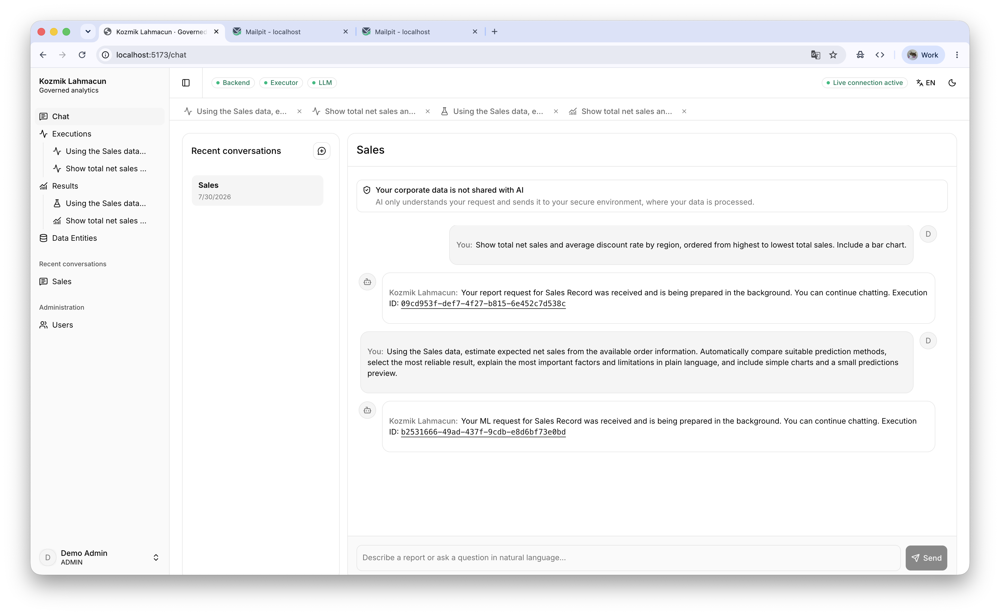 | 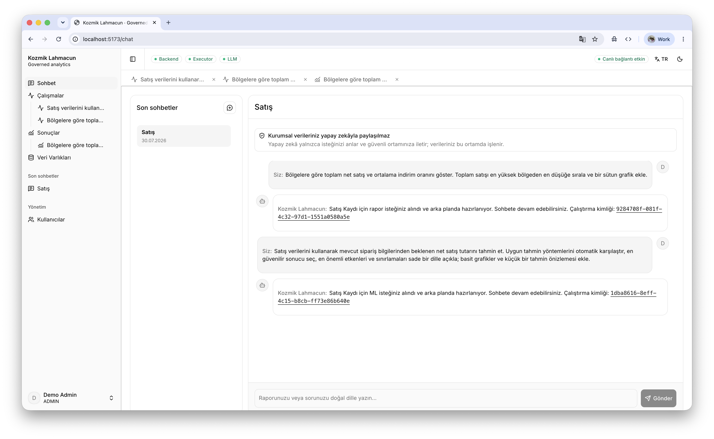 |

### Report execution and result

| Durable execution timeline | Management summary, indicators and chart |
|---|---|
| 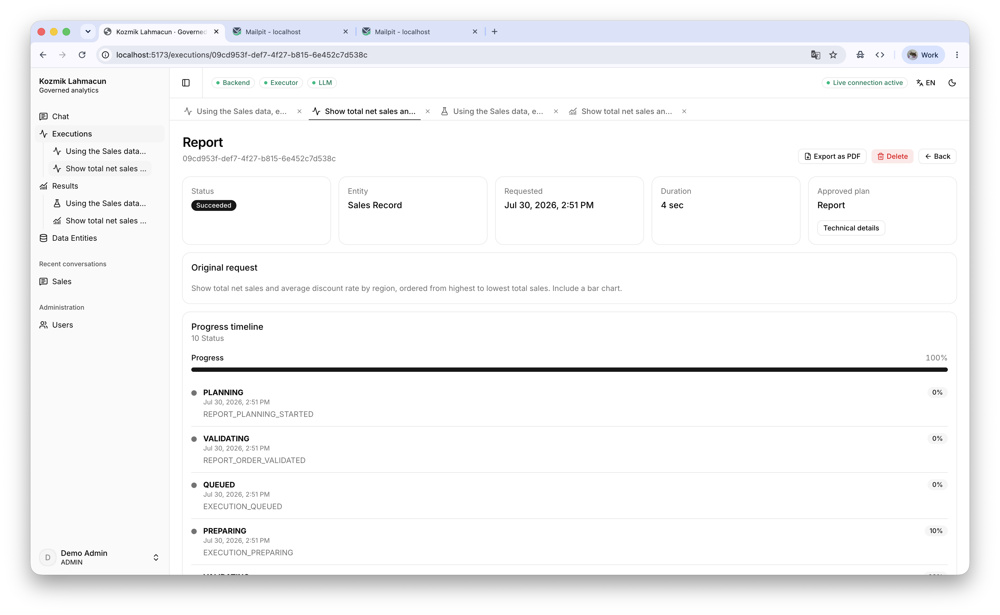 | 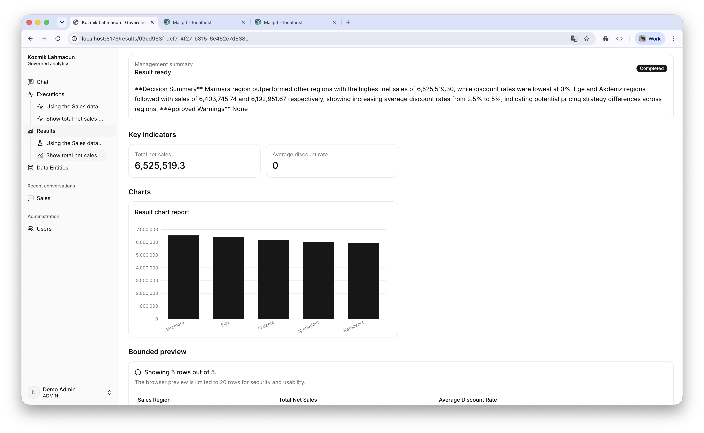 |

### Machine-learning result

| Plain-language management summary | Model selection, indicators and scenario charts |
|---|---|
| 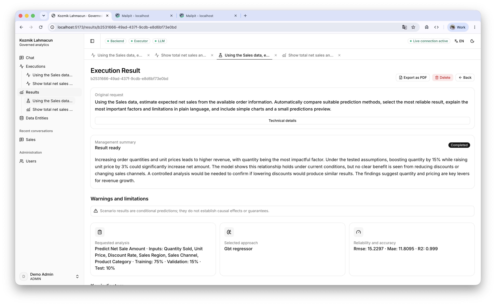 | 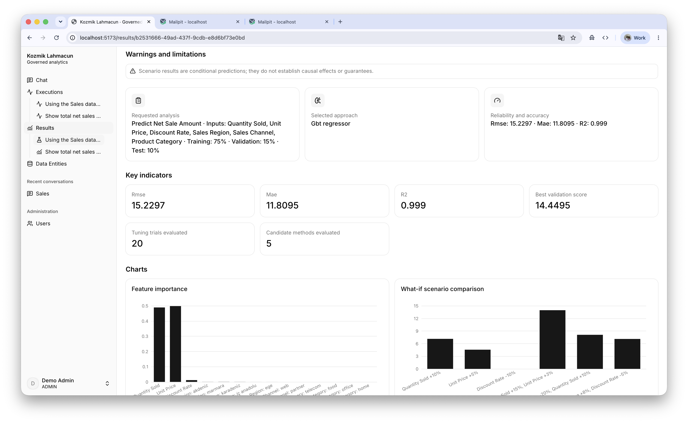 |

The browser exposes only a bounded result preview; the complete governed
result remains in object storage and is referenced by durable metadata.

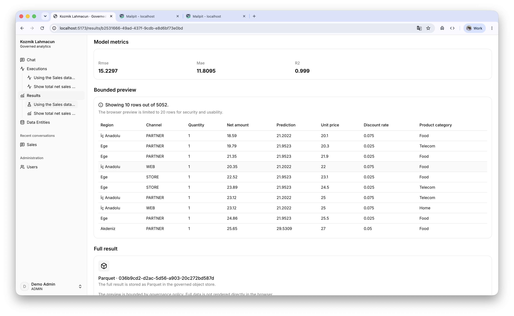

### Governed data entities

Entity names, descriptions and business column labels are generated from
structural metadata during ingestion in both supported languages. Switching
the UI language selects the stored localized presentation; it does not send
the underlying dataset to the LLM.

| Registered entities | Entity structure and ingestion state |
|---|---|
| 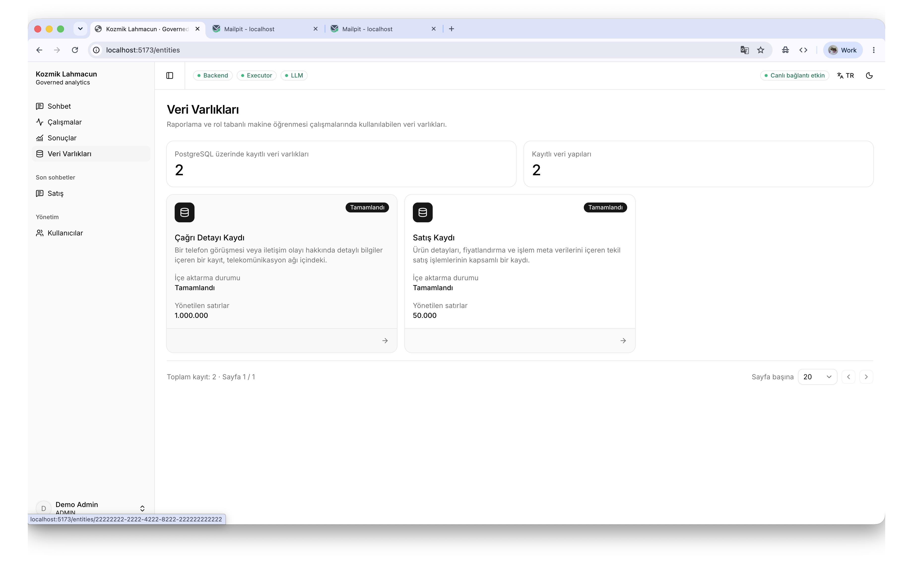 | 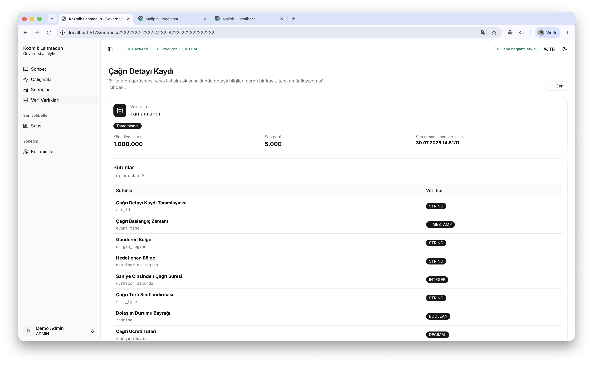 |

### Turkish execution and result experience

| Live ML execution progress | Turkish management result |
|---|---|
| 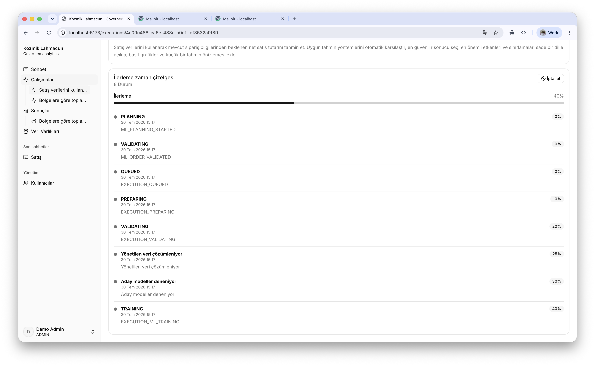 | 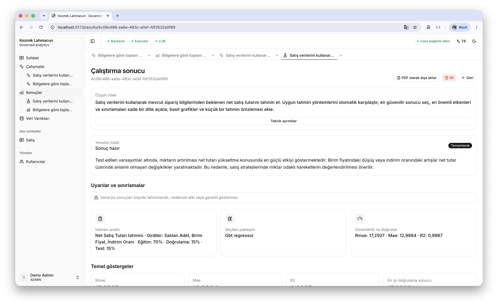 |

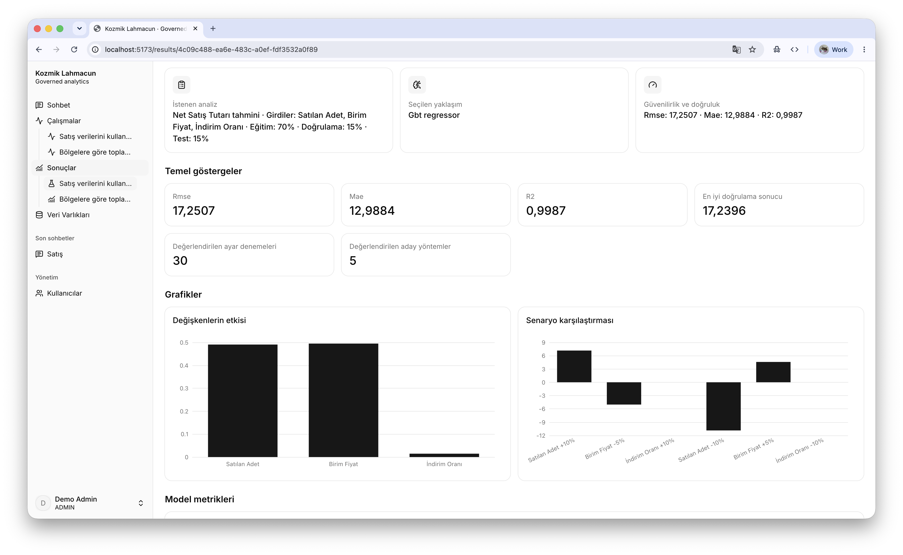

## Technology stack

| Layer | Technologies |
|---|---|
| Java control plane | Java 17, Spring Boot 4, Spring Security, Spring Data JPA, Spring Session, Spring Kafka, Flyway, Actuator, Lombok |
| Python execution plane | Python 3.12/3.13, FastAPI, Pydantic, PySpark 4, XGBoost, aiokafka, MinIO SDK, PyArrow, SQLite replay ledgers |
| Frontend | SvelteKit, TypeScript, shadcn-svelte, Tailwind CSS, Apache ECharts |
| Persistence and messaging | PostgreSQL, Redis, Kafka, MinIO |
| Identity and secrets | Keycloak, HashiCorp Vault |
| Local email | Mailpit |
| Verification | JUnit 5, Testcontainers, pytest, Ruff, Vitest, Testing Library and Playwright |
| Local orchestration | Docker Compose and Bash |

External boundaries use portable contracts: LLM access follows an
OpenAI-compatible protocol, analytical storage uses Parquet, and service
communication uses versioned HTTP and Kafka contracts.

## Security architecture

- Keycloak provides OIDC login, role claims, invitation links, password reset,
  and password-change flows.
- Java uses an opaque `KOZMIK_SESSION` HttpOnly browser cookie. OIDC access and
  refresh tokens remain server-side in Redis. Session fixation changes the
  session identifier after authentication, URL-based session tracking is
  disabled, the cookie is `SameSite=Lax` and secure by default, and one
  concurrent session is allowed per identity.
- Browser mutations are protected by a session-bound CSRF token. Internal
  service endpoints do not use browser CSRF; they require the separate
  internal-service credential.
- Authenticated API `POST` requests have a configurable per-identity,
  in-process minute window. This is abuse resistance for the current
  single-Java-instance topology rather than a distributed edge rate limiter.
- Java owns user authorization and ownership checks for chats, entities,
  executions, results, deletion, user administration, and PDF export
  visibility. Routes are deny-by-default, Admin APIs and non-health Actuator
  endpoints require `ADMIN`, and the hierarchy is
  `ADMIN > SCIENTIST > REPORTER`.
- Java-to-Python HTTP endpoints require a scoped internal API credential,
  compared using constant-time equality on both services.
- Application Kafka envelopes include contract versions, event and correlation
  identifiers, idempotency identifiers, and HMAC-SHA-256 signatures. Signatures
  provide message authenticity and integrity; they do not provide transport
  confidentiality.
- Executor-local SQLite ledgers persist replay and duplicate-processing state;
  they contain operational identifiers rather than corporate datasets and are
  isolated in the executor-owned volume.
- MinIO uses separate root, ingestion and executor credentials. The ingestion
  policy can write only to `raw/incoming`; the executor policy reads governed
  inputs and manages only refined, result and model objects. Java and the
  browser receive no MinIO data-plane credentials.
- Provider keys, MinIO credentials, database credentials, Redis credentials,
  internal credentials, SMTP credentials and message-signing material are not
  returned through browser APIs.
- Local `.env` material is ignored by Git and restricted to mode `0600`.
  Runtime services obtain scoped values from separate Vault paths; the
  optional OpenAI-compatible key is accepted from process/deployment input and
  is not persisted into `.env`.
- Java's Vault client is configured fail-fast for the integrated runtime.
  Python refuses startup when required Vault material, Java-owned effective
  configuration, or the configured LLM provider is unavailable; it does not
  silently replace the provider with a mock.
- Python never receives Keycloak administrative credentials or Docker control.
- Python never connects to PostgreSQL, and Java never executes Spark or reads
  and writes analytical MinIO objects.
- Flyway owns relational migrations in the dedicated `kozmik_lahmacun`
  application schema; Hibernate validates mappings and does not generate or
  mutate the schema at runtime.
- LLM inputs are allowlisted and size-bounded. Source datasets, result
  previews, direct identifiers, credentials and object paths are excluded from
  management-summary prompts.
- Failure records store safe codes, retryability, a sanitized technical reason,
  and a management-readable explanation.
- Deletion is ownership-aware. Execution deletion removes analytical artifacts
  through Python/MinIO coordination before relational cleanup is finalized.
- Retention covers chat data, executions, previews and artifacts and produces
  payload-free durable audit events.
- Admin PDF export uses the already-authorized rendered view; it does not expose
  raw Parquet or model artifacts.

## Runtime configuration

Configuration is operator-managed rather than editable from the product UI.
Defaults and binding names live in:

- [`.env.example`](.env.example) for Compose, ports, provider settings,
  execution limits and local paths;
- [`backend/src/main/resources/application.yml`](backend/src/main/resources/application.yml)
  for Java configuration bindings and defaults;
- [`infrastructure/compose.yaml`](infrastructure/compose.yaml) for the local
  service topology;
- [`infrastructure/vault/init-secrets.sh`](infrastructure/vault/init-secrets.sh)
  for the local Vault bootstrap mapping.

`scripts/setup-env.sh` creates the ignored `.env` file and replaces secret
placeholders with generated values. Non-secret runtime changes—Kafka address
and topic names, Redis host/port, service ports, Spark concurrency, execution
timeouts, preview limits, retention periods, log roots, LLM endpoint/model and
SMTP transport behavior—are supplied through environment variables. Java
maps them from `application.yml`; Python loads Java-owned effective execution
and LLM configuration during startup and reads its worker-specific environment
bindings.

Typical bindings include:

| Concern | Primary settings |
|---|---|
| Kafka | `KAFKA_PORT`, `KAFKA_BOOTSTRAP_SERVERS`, topic variables, consumer group and publish retry limits |
| Redis | `REDIS_HOST`, `REDIS_PORT`, `REDIS_TIMEOUT` |
| Spark/execution | `SPARK_MAX_CONCURRENT_JOBS`, `EXECUTION_TIMEOUT_SECONDS`, `EXECUTION_MAX_PREVIEW_ROWS` |
| LLM | `LLM_PROVIDER`, `LLM_BASE_URL`, `LLM_MODEL`, timeouts, retries and context bounds |
| MinIO | Endpoint, API/console ports, secure transport flag and scoped credential names |
| Retention | Chat, execution, preview and artifact periods plus scheduler expressions |
| Logging | `JAVA_LOG_DIR`, `PYTHON_LOG_DIR`, levels, history and size cap |
| SMTP | Host, port, sender, authentication, TLS/SSL and credential fields |

Runtime-bound configuration is loaded at service startup. A changed `.env` or
deployment secret source takes effect when the affected service or Compose
stack is restarted.

### Vault secret model

The local bootstrap creates separate scoped Vault contexts:

| Vault path | Consumers | Stored material |
|---|---|---|
| `secret/kozmik-backend` | Local Java process | PostgreSQL URL/user/password, Redis password, Keycloak client secret, SMTP credentials/settings, internal API key and Kafka signing key |
| `secret/kozmik-backend-container` | Containerized Java profile | Container-addressed equivalents of the backend secrets |
| `secret/kozmik-executor` | Python executor | Internal API key, Kafka signing key, scoped MinIO executor credentials and optional OpenAI-compatible API key |
| `secret/kozmik-infrastructure` | Bootstrap operations | PostgreSQL, Redis, Keycloak bootstrap and MinIO root/scoped credentials |
| `secret/kozmik-keycloak` | Keycloak/bootstrap | Database/bootstrap credentials, backend client secret, demo-user bootstrap credentials and SMTP configuration |

Java uses Spring Cloud Vault. Python reads only its executor path using a
separate least-privilege token. The OpenAI-compatible key is accepted from the
launching shell or a protected deployment secret file, written to Vault, and
not persisted to `.env`.

The repository includes
[`infrastructure/deployment-secrets.env.example`](infrastructure/deployment-secrets.env.example)
as the shape of a temporary protected deployment input. `KOZMIK_SECRETS_FILE`
allows deployment automation to inject that file during startup without
copying it into the repository.

### Local service and volume topology

The long-running Compose services are Vault, PostgreSQL, Redis, Kafka, MinIO,
Mailpit, Keycloak, Java, Python and SvelteKit. `vault-init`, `postgres-init`,
`database-reset`, `kafka-init` and `minio-init` are intentionally short-lived
bootstrap jobs; a successful exited state is expected and does not represent
an unhealthy platform service.

| Named volume | Durable local-demo responsibility |
|---|---|
| `postgres-data` | Java-owned relational metadata/history/audit state and the Keycloak database |
| `redis-data` | Server-side sessions and OIDC token state |
| `kafka-data` | Topics, offsets and retained event records |
| `minio-data` | Raw, refined, result and model objects |
| `keycloak-data` | Keycloak local runtime/import files; identity records reside in PostgreSQL |
| `executor-state` | Python SQLite replay/idempotency ledgers |
| `backend-logs`, `executor-logs` | Daily service logs |
| `mailpit-data` | Disposable local email-capture state |

`start-all.sh` intentionally removes and recreates these volumes for a clean,
deterministic demo. That behavior is a demo lifecycle decision, not a data
retention pattern for a persistent environment.

## Repository layout

```text
backend/         Java control plane and database migrations
executor/        Python planning, execution and ingestion plane
frontend/        SvelteKit product UI
infrastructure/  Docker Compose and service initialization
scripts/         Setup, lifecycle, smoke, seeding and acceptance commands
demo/            Deterministic generators, Kafka publisher and prompt scenarios
docs/            Public engineering and operating guides
```

Private architecture handoff material is intentionally outside the default
public repository content.

## Quick start

Prerequisites are Docker with Compose v2, Bash, OpenSSL, curl, Java 17, Maven,
Python 3.12 or 3.13, Node.js/npm, and an available configured LLM provider.

### Local evaluation procedure

After cloning the repository:

1. Review [`.env.example`](.env.example). The clean-demo launcher creates the
   ignored `.env` automatically. If provider or port settings must be changed
   before the first launch, generate it explicitly and edit the resulting
   `.env`:

   ```bash
   ./scripts/setup-env.sh
   ```

   For LM Studio, `LLM_BASE_URL` and `LLM_MODEL` must identify the running
   endpoint and exact loaded model. For an OpenAI-compatible provider, export
   `OPENAI_COMPATIBLE_API_KEY` in the launching shell and configure its base
   URL/model in `.env`.
2. Start and initialize the complete clean browser-demo suite:

   ```bash
   ./scripts/start-all.sh
   ```

   This is the primary macOS/iTerm2 entry point. It normalizes `.env`, rebuilds
   the Docker infrastructure, initializes Vault/PostgreSQL/Kafka/MinIO/
   Keycloak/Mailpit, starts Java/Python/SvelteKit in separate iTerm2 tabs,
   waits for health, and prints URLs plus demo credentials.
3. Seed both demonstration ingestion paths:

   ```bash
   ./scripts/seed-demo-data.sh
   ```

4. Open `http://localhost:5173`, sign in, and confirm that Sales and Telecom
   CDR appear under Data Entities.
5. Create a report from Chat:

   > Show total net sales and average discount rate by region, ordered from
   > highest to lowest total sales. Include a bar chart.

6. Sign in as Scientist or Admin and create an ML execution:

   > Using the Sales data, estimate expected net sales from the available order
   > information. Automatically compare suitable prediction methods, select
   > the most reliable result, and explain the important factors and
   > limitations in plain language.

7. Follow the asynchronous lifecycle under Executions and open the completed
   report or ML output under Results.

Local runtime settings are stored in an ignored `.env` file created by
`scripts/setup-env.sh`. The committed [`.env.example`](.env.example) shows the
complete configuration surface—including service ports, Kafka, Redis, MinIO,
Spark, LLM, retention, logging, SMTP, and Vault variable names—without
publishing runtime secrets.

The default provider is LM Studio at `http://localhost:1234/v1`. Its local
server must expose the exact model configured by `LLM_MODEL`. When an
OpenAI-compatible provider is used, export its key in the shell that launches
the platform:

```bash
export OPENAI_COMPATIBLE_API_KEY='your-provider-key'
./scripts/start-all.sh
```

`OPENAI_COMPATIBLE_API_KEY` is the canonical variable. The launcher reads it
from the launching process, selects `OPENAI_COMPATIBLE`, writes the key to the
executor's scoped Vault path, and does not copy it into `.env`. With no
exported key, `start-all.sh` selects the configured LM Studio provider.

### Complete clean browser demo

On macOS with iTerm2, the complete clean path is:

```bash
./scripts/start-all.sh
./scripts/seed-demo-data.sh
```

`start-all.sh`:

1. creates or normalizes the ignored `.env`;
2. validates the database baseline;
3. selects LM Studio or the OpenAI-compatible provider;
4. stops repository-owned local application processes;
5. removes the previous demo containers and named volumes;
6. starts Vault, PostgreSQL, Redis, Kafka, Mailpit, Keycloak and MinIO in
   dependency order;
7. initializes databases, Vault paths, Kafka topics, MinIO buckets and bucket
   notification, Keycloak realm/client/roles/users, and SMTP;
8. recreates the `kozmik_lahmacun` schema from `ddl.sql`;
9. opens iTerm2 zsh tabs for infrastructure logs, Java, Python and SvelteKit on
   macOS;
10. waits for each application health boundary and runs browser-demo smoke
    verification;
11. prints the local URLs and disposable demo credentials.

`seed-demo-data.sh`:

1. verifies the running platform;
2. generates deterministic 50,000-row Sales and 1,000,000-row Telecom CDR
   datasets;
3. uploads Sales to `raw/incoming`, triggering MinIO `ObjectCreated` ingestion;
4. publishes CDR as bounded chunks to the generic `ingestion.records.v1`
   stream;
5. waits for authoritative Java-owned ingestion state;
6. verifies the final governed row counts and artifacts.

The product is available at `http://localhost:5173`; Mailpit is available at
`http://localhost:8025`. The clean demo creates `reporter`, `scientist`, and
`admin` users. The launcher always prints these disposable credentials:

| Role | Username | Clean-demo password |
|---|---|---|
| Reporter | `reporter` | `Demo1234!` |
| Scientist | `scientist` | `Demo1234!` |
| Admin | `admin` | `Demo1234!` |

These predictable credentials exist only in the clean local demo realm.

### Portable multi-terminal startup

`start-all.sh` opens application processes in iTerm2 zsh tabs and therefore
requires macOS and iTerm2. The same suite can be started on another environment
with explicit terminals.

Initialize infrastructure and recreate the application schema:

```bash
./scripts/setup-env.sh
./scripts/dev-up.sh
docker compose --env-file .env -f infrastructure/compose.yaml \
  --profile full-demo run --rm --no-deps database-reset
```

Then run each application in its own terminal, in this order:

```bash
# Terminal 1
./scripts/backend-dev.sh

# Terminal 2, after Java is healthy
./scripts/executor-dev.sh

# Terminal 3
./scripts/frontend-dev.sh
```

Finally:

```bash
./scripts/seed-demo-data.sh
```

The portable path uses the generated demo passwords stored only in the ignored
`.env`; unlike `start-all.sh`, it does not replace them with the predictable
clean-demo password.

### Infrastructure-only lifecycle

```bash
./scripts/setup-env.sh
./scripts/dev-up.sh
./scripts/smoke-test.sh
```

`dev-up.sh` validates Compose configuration, initializes Vault and PostgreSQL,
starts Keycloak after its Vault-backed SMTP settings are resolved, initializes
Kafka topics, configures MinIO buckets/notification, and waits for health.
`smoke-test.sh` verifies PostgreSQL, Redis, Vault, Mailpit, Kafka topics, MinIO
notifications, and the Keycloak realm/client/roles.

Application services can then be started independently:

```bash
./scripts/backend-dev.sh
./scripts/executor-dev.sh
./scripts/frontend-dev.sh
```

### Shutdown

```bash
./scripts/dev-down.sh
./scripts/dev-down.sh --volumes
./scripts/stop-all.sh
```

- `dev-down.sh` stops Compose services while retaining named volumes.
- `dev-down.sh --volumes` also removes the project's named volumes.
- `stop-all.sh` stops repository-owned Java/Python/SvelteKit processes and
  removes the complete demo stack and named volumes while retaining `.env` and
  generated demo files.

## Health, logs and observability

Java exposes Spring Boot health probes under `/actuator/health`, including
`/actuator/health/liveness` and `/actuator/health/readiness`. Python exposes an
authenticated `/internal/v1/health`. The product header aggregates Backend,
Executor and LLM availability and separately indicates the live event
connection.

Java and Python write the same structured messages to their consoles and daily
UTF-8 files:

```text
logs/java/yyyy-MM/yyyy-MM-dd.log
logs/python/yyyy-MM/yyyy-MM-dd.log
```

Log roots and levels are configurable. Java log history and total size are
bounded. Durable lifecycle history and audit events remain separate from
filesystem logs.

## Event contracts

The local Kafka initializer creates:

- `execution.commands.v1`
- `execution.events.v1`
- `execution.results.v1`
- `execution.control.v1`
- `ingestion.events.v1`
- `ingestion.status.v1`
- `ingestion.records.v1`
- `ingestion.stream.status.v1`
- corresponding `.dlt` topics

Contracts include event and correlation identifiers, version fields, safe
failure codes, bounded payloads, and idempotency information. Java applies
execution lifecycle and result updates transactionally. Duplicate events do
not create duplicate status/history records or artifacts.

## Lifecycle and retention

- Cancellation records a durable request, publishes a signed control command,
  activates Python's cooperative cancellation event, and cancels the Spark job
  group.
- Terminal states cannot be replaced by conflicting late events.
- Timeout scanning is based on persisted execution deadlines.
- Users can delete their own chats, executions and results; Admins can manage
  all executions and results.
- Chat deletion physically removes the thread and cascades to owned messages.
- Execution/artifact deletion coordinates MinIO removal before relational
  cleanup is finalized and remains retryable after partial failure.
- Scheduled retention independently covers chats, executions, previews and
  artifacts.
- Soft-deleted relational data is hard-deleted after the configured retention
  period.

## Verification

Run the complete repository gate:

```bash
./scripts/test-all.sh
```

It runs static repository checks, Maven verification with JUnit 5 and
Testcontainers, Python Ruff and pytest/Spark tests, Svelte diagnostics,
component tests, a production frontend build, and Playwright end-to-end tests.

Run the separately maintained Java dependency vulnerability gate:

```bash
./scripts/backend-security-scan.sh
```

It runs OWASP Dependency-Check and fails for findings at or above CVSS 7.
`NVD_API_KEY` is optional but makes vulnerability-database updates faster and
more reliable.

Run deterministic demo acceptance:

```bash
./scripts/demo-acceptance.sh
```

This additionally verifies generation of the exact one-million-row CDR and
fifty-thousand-row Sales datasets.

## Current boundaries and limitations

- The architecture is currently single-tenant.
- The product UI supports English and Turkish.
- The report grammar is intentionally restricted to registered read-only
  operations; arbitrary SQL is outside the platform contract.
- ML coverage is intentionally restricted to the documented problem types,
  algorithms, parameter ranges, maximum five candidates, and maximum fifty
  trials.
- Browser previews are limited to 20 rows. Full results remain governed
  Parquet artifacts and are not directly downloadable.
- What-if results are conditional predictions, not causal evidence or
  guaranteed business outcomes.
- Management-summary quality depends on provider capability and the clarity of
  available schema metadata, while deterministic validators remain the
  execution authority.
- A summary-provider failure does not fail a completed Spark result.
- The included Docker Compose topology is a complete local and
  controlled-environment profile, not a high-availability topology.
- The current execution topology supports one executor instance. Its SQLite
  replay ledgers are local durable state and cannot coordinate multiple
  executor replicas; horizontal scaling requires a shared transactional
  idempotency/state mechanism.
- Local Kafka uses plaintext transport, Keycloak uses loopback HTTP, and Vault
  uses its disposable local bootstrap mode. The architecture exposes
  environment bindings for secured external equivalents.
- The local Keycloak profile enables HTTP and relaxed hostname validation for
  loopback browser use. It runs the Keycloak `start` command, but its transport
  and hostname policy remain local-profile settings.
- The clean demo uses one PostgreSQL server account for both the application
  database and Keycloak database. They are logically separated by database and
  schema, not by local database credentials.
- HMAC-signed Kafka envelopes protect integrity but do not encrypt local Kafka
  payloads. Java-to-Python traffic also uses HTTP in the local profile; network
  confidentiality is therefore a deployment-boundary property rather than an
  application-layer claim.
- The built-in request limiter and SSE subscriber registries are in-process
  controls. They are not shared between multiple Java replicas.
- Local named volumes, including SQLite replay ledgers, are not encrypted by
  the application. At-rest protection is inherited from the container host or
  external storage platform.
- The SQLite ledger files are isolated in the executor volume but do not
  currently set application-managed per-file encryption.
- Mailpit is the included local email-capture implementation.
- PDF export uses the browser print engine and is restricted to Admins after an
  execution or result reaches its exportable state.
- Jupyter is intentionally outside the product UI.

## License

Copyright © 2026 Emre Gülay (emre@gulay.io). All rights reserved.

Kozmik Lahmacun is source-available proprietary software, not open-source
software. You may download, build, and run it in unmodified form for
personal, non-commercial learning, testing, and evaluation only.
Commercial use, production use, modification, derivative works,
redistribution, resale, hosting, and integration into another product or
service all require prior written permission.

This license is governed by the laws of the Republic of Türkiye. See the
complete [Kozmik Lahmacun Source-Available Evaluation License](./LICENSE)
for full terms, including the warranty disclaimer and termination
conditions.

SPDX-License-Identifier: `LicenseRef-Kozmik-Lahmacun-Evaluation-1.0`

Permission and commercial-license requests: emre@gulay.io

## Further documentation

- [Local development](docs/local-development.md)
- [Demo and acceptance](docs/demo-and-acceptance.md)
- [LLM provider and classification](docs/llm-provider-and-classification.md)
- [Trusted report execution](docs/trusted-report-execution.md)
- [ML planning and execution](docs/ml-planning-and-execution.md)
- [Privacy-safe result explanation](docs/privacy-safe-result-explanation.md)
- [MinIO ingestion](docs/minio-ingestion.md)
- [Streaming ingestion](docs/streaming-ingestion.md)
- [Chat streaming](docs/chat-streaming.md)
- [Lifecycle hardening](docs/lifecycle-hardening.md)
- [Final acceptance report](docs/final-acceptance-report.md)
